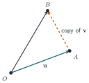
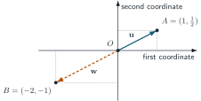

+++
order = 2
subject = "mathematics"
authoring_model = "gpt-5.6-sol"
authoring_run_id = "request-27"
authoring_provider = "openai"
authoring_reasoning_effort = "high"
curriculum_model = "gpt-5.6-sol"
curriculum_run_id = "request-25"
curriculum_provider = "openai"
curriculum_reasoning_effort = "high"
tags = ["linear-algebra", "vectors", "linear-combinations", "span"]
prerequisites = ["chapter:01_linear_systems_and_elimination"]
provides = [
  "coordinate-vector",
  "column-vector-convention",
  "vector-addition",
  "scalar-multiplication",
  "zero-vector",
  "linear-combination",
  "vector-equation",
  "span",
  "span-membership",
  "homogeneous-linear-system",
]
+++

# Vectors, linear combinations, and span

<!-- card-id: 25347fc5-339e-4f47-8556-936ba86f0bf7 -->
Q: A **coordinate vector** is an ordered list of real-number entries. This deck uses the **column-vector convention**, writing the entries vertically in their stated order. Which column vector records the ordered list \((3,-2,5)\)?
A: **It is \(\left[\begin{array}{r}3\\-2\\5\end{array}\right]\).** The top, middle, and bottom entries preserve the first, second, and third positions of the ordered list.

<!-- card-id: cc365f12-37ca-444b-a29c-b7654c00661c -->
Q: Two coordinate vectors are equal exactly when they have the same number of entries and every pair of corresponding entries is equal. Are \(\left[\begin{array}{r}2\\-1\end{array}\right]\) and \(\left[\begin{array}{r}2\\1\end{array}\right]\) equal? Give the decisive comparison.
A: **No.** Their second entries are \(-1\) and \(1\), so the corresponding-entry test fails.

<!-- card-id: 802f1984-daa4-4814-b709-086344e0df21 -->
Q: **Vector addition** adds corresponding entries of vectors that have the same number of entries. What is \(\left[\begin{array}{r}2\\-1\end{array}\right]+\left[\begin{array}{r}3\\4\end{array}\right]\)?
A: **The sum is \(\left[\begin{array}{r}5\\3\end{array}\right]\).** The entries are \(2+3=5\) and \(-1+4=3\).

<!-- card-id: 287963aa-6e76-466c-a461-180201990b6c -->
Q: Why is \(\left[\begin{array}{r}1\\2\end{array}\right]+\left[\begin{array}{r}3\\4\\5\end{array}\right]\) not defined by coordinate-vector addition?
A: **The vectors have different numbers of entries, so the entries cannot be paired completely.** Coordinate-vector addition requires one corresponding entry from each vector in every position.

<!-- card-id: b16dbef4-b4ee-4a2c-a4d0-d4b3bd798e3f -->
Q: A real number used to multiply a vector is called a **scalar**. **Scalar multiplication** multiplies every vector entry by that scalar. What is \(-2\left[\begin{array}{r}3\\-1\end{array}\right]\)?
A: **The result is \(\left[\begin{array}{r}-6\\2\end{array}\right]\).** Multiplying both entries by \(-2\) gives \(-2(3)=-6\) and \(-2(-1)=2\).

<!-- card-id: 8d83336b-5f61-462e-9613-9ac2caa52c97 -->
Q: The **zero vector** of a given length has zero in every entry. Which two-entry vector can be added to any two-entry vector without changing it?
A: **It is \(\left[\begin{array}{r}0\\0\end{array}\right]\).** Adding it leaves each original entry unchanged because \(a+0=a\).

<!-- card-id: 73142b11-a6ad-4b7d-90b6-341a68dc2c5b -->
Q: For a two-entry vector, draw a horizontal first-coordinate axis and a vertical second-coordinate axis; their zero meeting point is the **origin**. The vector \(\left[\begin{array}{r}2\\-1\end{array}\right]\) is represented by an arrow from the origin whose tip has those two coordinates. Where is its tip relative to the origin?
A: **Its tip is at first coordinate \(2\) and second coordinate \(-1\).** It lies in the positive direction of the first axis and the negative direction of the second axis.

<!-- card-id: f63ba28c-c25d-48d0-9537-1ddf6cba08e7 -->
Q: In the diagram, \(\mathbf u\) goes from \(O\) to \(A\). The dashed arrow from \(A\) to \(B\) is a translated copy of \(\mathbf v\): it has the same coordinate change as \(\mathbf v\) but starts at \(A\). Which arrow from \(O\) represents \(\mathbf u+\mathbf v\)?

A: **The arrow from \(O\) to \(B\) represents \(\mathbf u+\mathbf v\).** Following \(\mathbf u\) and then the copied \(\mathbf v\) adds their coordinate changes.

<!-- card-id: acea6ebe-e046-447e-afb6-f10126e7561c -->
Q: The diagram shows \(\mathbf u\) from \(O\) to \(A=(1,\tfrac12)\) and \(\mathbf w\) from \(O\) to \(B=(-2,-1)\). Find the scalar \(k\) in \(\mathbf w=k\mathbf u\).

A: **The scalar is \(k=-2\).** Multiplication by \(-2\) changes \((1,\tfrac12)\) to \((-2,-1)\); the negative sign reverses both coordinate directions while the factor \(2\) doubles their sizes.

<!-- card-id: 18ce3653-35fa-46bf-9a90-4731c4937ecd -->
P: Let \(\mathbf u=\left[\begin{array}{r}1\\-2\end{array}\right]\) and \(\mathbf v=\left[\begin{array}{r}3\\1\end{array}\right]\). Compute \(2\mathbf u+(-1)\mathbf v\).
S: **IDENTIFY**

This is a coordinate-vector calculation using scalar multiplication followed by vector addition.

**PLAN**

Scale each vector entry, then add corresponding entries.

**EXECUTE**

**The result is \(\left[\begin{array}{r}-1\\-5\end{array}\right]\).** Since \(2\mathbf u=\left[\begin{array}{r}2\\-4\end{array}\right]\) and \((-1)\mathbf v=\left[\begin{array}{r}-3\\-1\end{array}\right]\), their sum is \(\left[\begin{array}{r}2-3\\-4-1\end{array}\right]\).

**EVALUATE**

Checking entry by entry gives \(2(1)-3=-1\) and \(2(-2)-1=-5\), matching the result.

<!-- card-id: d38c064a-0451-43c4-96e4-43cf90365c9a -->
Q: A **linear combination** of given vectors is a sum of scalar multiples of those vectors. What feature makes \(2\mathbf u-3\mathbf v\) a linear combination of \(\mathbf u\) and \(\mathbf v\)?
A: **It can be written \(2\mathbf u+(-3)\mathbf v\), a sum of one scalar multiple of each given vector.** The scalars \(2\) and \(-3\) are its coefficients.

<!-- card-id: c82a0011-56fa-4bfd-b141-9140b8b3abf5 -->
P: Let \(\mathbf u=\left[\begin{array}{r}1\\2\end{array}\right]\) and \(\mathbf v=\left[\begin{array}{r}-1\\4\end{array}\right]\). Compute the linear combination \(3\mathbf u-2\mathbf v\).
S: **IDENTIFY**

This is a linear-combination computation with two coordinate vectors.

**PLAN**

Compute the two scalar multiples and add their corresponding entries.

**EXECUTE**

**The linear combination equals \(\left[\begin{array}{r}5\\-2\end{array}\right]\).** We have \(3\mathbf u=\left[\begin{array}{r}3\\6\end{array}\right]\) and \(-2\mathbf v=\left[\begin{array}{r}2\\-8\end{array}\right]\), whose sum is \(\left[\begin{array}{r}5\\-2\end{array}\right]\).

**EVALUATE**

Direct entry checks give \(3(1)-2(-1)=5\) and \(3(2)-2(4)=-2\).

<!-- card-id: c583b0ee-759b-45c9-988a-7ee62ffeefaa -->
Q: A **vector equation** can ask for unknown scalar coefficients in a linear combination. Which simultaneous coordinate equations are equivalent to

\[
c_1\left[\begin{array}{r}1\\2\end{array}\right]
+c_2\left[\begin{array}{r}-1\\1\end{array}\right]
=\left[\begin{array}{r}4\\5\end{array}\right]?
\]
A: **The coordinate equations are \(c_1-c_2=4\) and \(2c_1+c_2=5\).** Equal vectors have equal corresponding entries, so the first and second positions produce the two equations.

<!-- card-id: 7a060c55-f15b-4200-8218-621def98e783 -->
P: Solve the vector equation

\[
c_1\left[\begin{array}{r}1\\1\end{array}\right]
+c_2\left[\begin{array}{r}2\\-1\end{array}\right]
=\left[\begin{array}{r}5\\2\end{array}\right].
\]
Give \(c_1\) and \(c_2\).
S: **IDENTIFY**

This vector equation becomes a two-variable linear system by equating corresponding entries.

**PLAN**

Write the coordinate equations, solve them by elimination, and substitute the coefficients back into the vector equation.

**EXECUTE**

**The coefficients are \(c_1=3\) and \(c_2=1\).** The coordinate equations are \(c_1+2c_2=5\) and \(c_1-c_2=2\). Subtracting the second equation from the first gives \(3c_2=3\), so \(c_2=1\) and then \(c_1=3\).

**EVALUATE**

Substitution gives \(3\left[\begin{array}{r}1\\1\end{array}\right]+\left[\begin{array}{r}2\\-1\end{array}\right]=\left[\begin{array}{r}5\\2\end{array}\right]\).

<!-- card-id: 7e0fe0c9-32f9-4e88-8f16-30b8ce96df37 -->
Q: The **span** of given vectors is the collection of all their linear combinations, written \(\operatorname{span}\{\mathbf u,\mathbf v,\ldots\}\). The symbol \(\in\) means “is in.” If \(\mathbf b=2\mathbf u-\mathbf v\), what certifies that \(\mathbf b\in\operatorname{span}\{\mathbf u,\mathbf v\}\)?
A: **The coefficients \(2\) and \(-1\) explicitly write \(\mathbf b\) as a linear combination of the listed vectors.** Such a coefficient choice is a membership certificate.

<!-- card-id: b1b4402a-20b9-4f16-a7b5-e493c1db276a -->
Q: Why does \(\operatorname{span}\{\mathbf u,\mathbf v\}\) always contain the zero vector when \(\mathbf u\) and \(\mathbf v\) have the same number of entries?
A: **Choose both scalar coefficients to be zero.** Then \(0\mathbf u+0\mathbf v\) is the zero vector, so it is one of the allowed linear combinations.

<!-- card-id: 83da928a-1e06-424c-86a9-a9be3fd91da2 -->
Q: To decide whether \(\mathbf b\) lies in \(\operatorname{span}\{\mathbf u,\mathbf v\}\), why is it enough to test whether the coefficient system for \(c_1\mathbf u+c_2\mathbf v=\mathbf b\) is consistent?
A: **A solution supplies coefficients that express \(\mathbf b\) as a linear combination; inconsistency proves no such coefficients exist.** This is exactly the definition of span translated into a linear-system question.

<!-- card-id: da58b522-364e-40ac-a5e5-d78d6380fe16 -->
P: Decide whether \(\mathbf b=\left[\begin{array}{r}5\\4\end{array}\right]\) lies in the span of \(\mathbf u=\left[\begin{array}{r}1\\2\end{array}\right]\) and \(\mathbf v=\left[\begin{array}{r}2\\1\end{array}\right]\). If it does, give coefficients.
S: **IDENTIFY**

This is a span-membership question, so the unknowns are scalar coefficients in \(c_1\mathbf u+c_2\mathbf v=\mathbf b\).

**PLAN**

Equate corresponding entries, solve the resulting system, and verify the resulting linear combination.

**EXECUTE**

**Yes; \(\mathbf b=1\mathbf u+2\mathbf v\).** The coordinate equations are \(c_1+2c_2=5\) and \(2c_1+c_2=4\), whose solution is \(c_1=1\), \(c_2=2\).

**EVALUATE**

\(\left[\begin{array}{r}1\\2\end{array}\right]+2\left[\begin{array}{r}2\\1\end{array}\right]=\left[\begin{array}{r}5\\4\end{array}\right]\), so the coefficients give the required membership certificate.

<!-- card-id: 39925a04-fd90-4fd1-b771-a074760ac474 -->
P: Decide whether \(\mathbf b=\left[\begin{array}{r}3\\5\end{array}\right]\) lies in the span of \(\mathbf u=\left[\begin{array}{r}1\\2\end{array}\right]\) and \(\mathbf v=\left[\begin{array}{r}2\\4\end{array}\right]\). Justify the decision by elimination.
S: **IDENTIFY**

This is a span-membership question whose coefficient system may be inconsistent.

**PLAN**

Form the coordinate equations for \(c_1\mathbf u+c_2\mathbf v=\mathbf b\), then eliminate \(c_1\) and inspect the remaining row.

**EXECUTE**

**No; \(\mathbf b\notin\operatorname{span}\{\mathbf u,\mathbf v\}\).** The augmented matrix \(\left[\begin{array}{cc|c}1&2&3\\2&4&5\end{array}\right]\) becomes \(\left[\begin{array}{cc|c}1&2&3\\0&0&-1\end{array}\right]\) after row 2 \(\leftarrow\) row 2 \(-2\)(row 1), so the coefficient system is inconsistent.

**EVALUATE**

Twice the first coordinate equation would require the second right side to be \(6\), not \(5\), confirming the contradiction.

<!-- card-id: 7c4a7add-7232-4a1c-bc54-a4739f940a69 -->
Q: A **homogeneous linear system** has zero as the right-side constant in every equation. Without elimination, which solution tuple must satisfy \(x-3y=0\) and \(2x+y=0\), and why?
A: **The tuple \((x,y)=(0,0)\) must satisfy it.** Substitution makes both left sides zero, matching the zero right sides.

<!-- card-id: ce809411-1dab-4af5-be25-ae6a97a88eaf -->
P: Parametrize every solution of the homogeneous system \(x+2y=0\), write each solution as a coordinate vector, and describe the solution collection as the span of one vector.
S: **IDENTIFY**

This is a homogeneous linear system with one free variable, followed by a translation from parametric to span notation.

**PLAN**

Choose a parameter for the free variable, solve for the pivot variable, factor the parameter from the coordinate vector, and verify the original equation.

**EXECUTE**

**Every solution vector is \(t\left[\begin{array}{r}-2\\1\end{array}\right]\), so the solution collection is \(\operatorname{span}\left\{\left[\begin{array}{r}-2\\1\end{array}\right]\right\}\).** Set \(y=t\); then \(x=-2t\), and \(\left[\begin{array}{r}x\\y\end{array}\right]=\left[\begin{array}{r}-2t\\t\end{array}\right]=t\left[\begin{array}{r}-2\\1\end{array}\right]\).

**EVALUATE**

Substitution gives \(-2t+2t=0\) for every real number \(t\), and every scalar multiple shown therefore solves the system.

<!-- card-id: 19b93161-2c9b-4fe2-838d-a181e3b0b0e0 -->
Q: To test whether a nonzero vector \(\mathbf b\) is in \(\operatorname{span}\{\mathbf u,\mathbf v\}\), a learner solves \(c_1\mathbf u+c_2\mathbf v=\mathbf 0\). What is the error, and which vector must appear on the right instead?
A: **The learner tested a homogeneous zero-target equation instead of membership of \(\mathbf b\).** The required equation is \(c_1\mathbf u+c_2\mathbf v=\mathbf b\).

<!-- card-id: c2021da9-8e70-4d17-9e81-b6ef4dac36a3 -->
Q: A learner claims that \(\operatorname{span}\left\{\left[\begin{array}{r}1\\0\end{array}\right],\left[\begin{array}{r}0\\1\end{array}\right]\right\}\) contains only the two listed vectors. Give one vector that decisively refutes the claim and show its coefficients.
A: **For example, \(\left[\begin{array}{r}1\\1\end{array}\right]\) is also in the span.** It equals \(1\left[\begin{array}{r}1\\0\end{array}\right]+1\left[\begin{array}{r}0\\1\end{array}\right]\); a span contains all linear combinations, not only the vectors listed in its notation.
