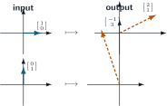

+++
order = 3
subject = "mathematics"
authoring_model = "gpt-5.6-sol"
authoring_run_id = "request-28"
authoring_provider = "openai"
authoring_reasoning_effort = "high"
curriculum_model = "gpt-5.6-sol"
curriculum_run_id = "request-25"
curriculum_provider = "openai"
curriculum_reasoning_effort = "high"
tags = ["linear-algebra", "matrices", "linear-transformations"]
prerequisites = ["chapter:02_vectors_linear_combinations_and_span"]
provides = [
  "matrix",
  "matrix-shape-and-entry",
  "matrix-vector-product",
  "matrix-addition",
  "scalar-matrix-multiplication",
  "identity-matrix",
  "transpose",
  "matrix-product",
  "coordinate-linear-transformation",
  "matrix-composition",
]
+++

# Matrices and coordinate transformations

<!-- card-id: 71cc4ded-812a-4280-8275-442ceaf36bc1 -->
Q: A **matrix** is a rectangular array of numbers arranged in rows and columns. In the matrix \(\left[\begin{array}{rrr}2&-1&4\\0&5&3\end{array}\right]\), which number is in row 2, column 3?
A: **The entry is \(3\).** Row 2 is \([0,5,3]\), and its third position contains \(3\).

<!-- card-id: a935c1fe-cef4-41fb-8389-ca7ee6655bbe -->
Q: A matrix with \(m\) rows and \(n\) columns has **shape** \(m\times n\). The notation \(a_{ij}\) names the entry in row \(i\), column \(j\). For \(A=\left[\begin{array}{rrr}2&-1&4\\0&5&3\end{array}\right]\), what are the shape of \(A\) and the entry \(a_{12}\)?
A: **The shape is \(2\times3\), and \(a_{12}=-1\).** The row number is written first in both the shape and the entry index.

<!-- card-id: e7c2dbb7-aed3-4a44-a794-489389c1bc16 -->
Q: Two matrices are equal exactly when they have the same shape and equal corresponding entries. Are \(\left[\begin{array}{rr}1&2\\3&4\end{array}\right]\) and \(\left[\begin{array}{rr}1&2\\3&5\end{array}\right]\) equal? Give the decisive comparison.
A: **No.** Their row-2, column-2 entries are \(4\) and \(5\), so the corresponding-entry test fails.

<!-- card-id: b9752adf-6bb8-479c-b0b1-81618ba8f26f -->
Q: **Matrix addition** adds corresponding entries of matrices with the same shape. What is \(\left[\begin{array}{rr}1&-2\\3&0\end{array}\right]+\left[\begin{array}{rr}4&1\\-1&5\end{array}\right]\)?
A: **The sum is \(\left[\begin{array}{rr}5&-1\\2&5\end{array}\right]\).** Each result occupies the same row and column position as the two entries that were added.

<!-- card-id: fb8e2aca-4231-4fba-8a1a-9b1de08eccdc -->
Q: Why is \(\left[\begin{array}{rr}1&2\\3&4\end{array}\right]+\left[\begin{array}{rrr}5&6&7\\8&9&10\end{array}\right]\) not defined by matrix addition?
A: **The shapes differ: \(2\times2\) versus \(2\times3\).** The third-column entries of the second matrix have no corresponding entries in the first.

<!-- card-id: b2404271-ab23-4b1e-ba0c-a8b2cf6dbab5 -->
Q: **Scalar–matrix multiplication** multiplies every matrix entry by the scalar. What is \(-2\left[\begin{array}{rr}3&-1\\0&4\end{array}\right]\)?
A: **The result is \(\left[\begin{array}{rr}-6&2\\0&-8\end{array}\right]\).** The same scalar multiplies every row and column position.

<!-- card-id: 3e8a63c3-acec-4110-836e-e792fe07c379 -->
Q: If a matrix is written by its column vectors as \(A=\left[\begin{array}{rr}\mathbf u&\mathbf v\end{array}\right]\), the **matrix–vector product** is defined by \(A\left[\begin{array}{r}c_1\\c_2\end{array}\right]=c_1\mathbf u+c_2\mathbf v\). For \(\mathbf u=\left[\begin{array}{r}1\\3\end{array}\right]\) and \(\mathbf v=\left[\begin{array}{r}2\\-1\end{array}\right]\), what is \(A\left[\begin{array}{r}2\\-1\end{array}\right]\)?
A: **The product is \(\left[\begin{array}{r}0\\7\end{array}\right]\).** The input entries are the weights: \(2\mathbf u-\mathbf v=\left[\begin{array}{r}2\\6\end{array}\right]-\left[\begin{array}{r}2\\-1\end{array}\right]\).

<!-- card-id: ecb6e435-edea-4282-9780-52caffc67f6d -->
Q: If \(A\) has shape \(3\times2\), how many entries must \(\mathbf x\) have for \(A\mathbf x\) to be defined, and how many entries will the output have?
A: **The input must have \(2\) entries, and the output has \(3\) entries.** The input supplies one weight per column; each column has one entry per matrix row.

<!-- card-id: eabaa070-841b-44cd-a093-9ee4f2137658 -->
Q: The row rule for \(A\mathbf x\) pairs each matrix row with the entries of \(\mathbf x\): multiply corresponding numbers and add. If \(A=\left[\begin{array}{rrr}2&-1&3\\0&4&1\end{array}\right]\) and \(\mathbf x=\left[\begin{array}{r}a\\b\\c\end{array}\right]\), what is the first entry of \(A\mathbf x\)?
A: **The first entry is \(2a-b+3c\).** It comes from \(2(a)+(-1)(b)+3(c)\), using the first row.

<!-- card-id: bfdfba18-2077-482d-b75a-8e2f746c7d6c -->
P: Let \(A=\left[\begin{array}{rr}1&-1\\0&3\\2&4\end{array}\right]\) and \(\mathbf x=\left[\begin{array}{r}2\\-1\end{array}\right]\). Compute \(A\mathbf x\).
S: **IDENTIFY**

This is a matrix–vector product: the input entries weight the two columns of \(A\).

**PLAN**

Form the linear combination \(2\)(first column) \(-1\)(second column), then check the result row by row.

**EXECUTE**

**The product is \(A\mathbf x=\left[\begin{array}{r}3\\-3\\0\end{array}\right]\).** Indeed,
\[
2\left[\begin{array}{r}1\\0\\2\end{array}\right]
-\left[\begin{array}{r}-1\\3\\4\end{array}\right]
=\left[\begin{array}{r}3\\-3\\0\end{array}\right].
\]

**EVALUATE**

The row checks are \(1(2)+(-1)(-1)=3\), \(0(2)+3(-1)=-3\), and \(2(2)+4(-1)=0\).

<!-- card-id: c43f24e5-41ca-429d-823d-a51be7b38340 -->
Q: Let \(A=\left[\begin{array}{rr}1&2\\-1&3\end{array}\right]\), \(\mathbf x=\left[\begin{array}{r}c_1\\c_2\end{array}\right]\), and \(\mathbf b=\left[\begin{array}{r}4\\5\end{array}\right]\). Which simultaneous equations are expressed compactly by the **matrix equation** \(A\mathbf x=\mathbf b\)?
A: **They are \(c_1+2c_2=4\) and \(-c_1+3c_2=5\).** The equation also says that \(\mathbf b\) is the column combination \(c_1\left[\begin{array}{r}1\\-1\end{array}\right]+c_2\left[\begin{array}{r}2\\3\end{array}\right]\).

<!-- card-id: 3ed819fc-02a0-4759-8302-0305ddb33ad6 -->
Q: The \(n\times n\) **identity matrix** \(I_n\) has ones on its main diagonal—positions whose row and column numbers match—and zeros elsewhere. For example, \(I_2=\left[\begin{array}{rr}1&0\\0&1\end{array}\right]\). What is \(I_2\left[\begin{array}{r}x\\y\end{array}\right]\), and why does this action justify the name “identity”?
A: **The result is \(\left[\begin{array}{r}x\\y\end{array}\right]\), unchanged.** Its columns are \(\left[\begin{array}{r}1\\0\end{array}\right]\) and \(\left[\begin{array}{r}0\\1\end{array}\right]\), so the input weights reproduce the input vector.

<!-- card-id: 6e02f5fe-f7b9-4a13-8496-acab9ead944c -->
Q: Which identity matrix can multiply a three-entry coordinate vector without changing it: \(I_2\) or \(I_3\)? Give the size reason.
A: **Use \(I_3\).** Its three columns accept the three input entries, and its three rows return a three-entry output.

<!-- card-id: d9ab5b86-6c61-473f-b59e-be3455eb4395 -->
Q: The **transpose** \(A^{\mathsf T}\) exchanges row and column positions: entry \((i,j)\) of \(A\) becomes entry \((j,i)\) of \(A^{\mathsf T}\). What is the transpose of \(A=\left[\begin{array}{rrr}1&2&3\\4&5&6\end{array}\right]\)?
A: **It is \(A^{\mathsf T}=\left[\begin{array}{rr}1&4\\2&5\\3&6\end{array}\right]\).** Each row of \(A\) becomes the corresponding column of \(A^{\mathsf T}\).

<!-- card-id: a5b466c3-c0d3-4b62-b653-736254fd4614 -->
Q: If \(A\) has shape \(m\times n\), what shape does \(A^{\mathsf T}\) have? Explain from the transpose rule.
A: **The shape is \(n\times m\).** Exchanging every row position with a column position exchanges the row and column counts.

<!-- card-id: 98832dc8-6fd3-49ba-99a9-2f1039b8fe39 -->
Q: A **coordinate transformation** \(T\) is an input–output rule that assigns each allowed coordinate vector exactly one output vector; \(T(\mathbf x)\) denotes the output for input \(\mathbf x\). If \(T\left(\left[\begin{array}{r}a\\b\end{array}\right]\right)=\left[\begin{array}{r}a+b\\b\end{array}\right]\), what is \(T\left(\left[\begin{array}{r}2\\-1\end{array}\right]\right)\)?
A: **The output is \(\left[\begin{array}{r}1\\-1\end{array}\right]\).** Substitute \(a=2\) and \(b=-1\) into the stated rule.

<!-- card-id: c6bce4ef-51cc-4196-91f1-4b36bf98e6b7 -->
Q: A coordinate transformation \(T\) is **linear** when, for all allowed vectors \(\mathbf u,\mathbf v\) and real scalars \(c\),
\[
T(\mathbf u+\mathbf v)=T(\mathbf u)+T(\mathbf v)
\quad\text{and}\quad
T(c\mathbf u)=cT(\mathbf u).
\]
Which two established vector operations does a linear transformation preserve?
A: **It preserves vector addition and scalar multiplication.** Transforming after either operation gives the same output as transforming first and then performing that operation on the outputs.

<!-- card-id: c0cc2ac0-9478-4c09-b3b0-3ebb406074e7 -->
Q: Let \(T(\mathbf x)=A\mathbf x\), where \(A=\left[\begin{array}{rr}1&2\\0&-1\end{array}\right]\), \(\mathbf u=\left[\begin{array}{r}1\\0\end{array}\right]\), and \(\mathbf v=\left[\begin{array}{r}0\\2\end{array}\right]\). What common vector results from computing both \(T(\mathbf u+\mathbf v)\) and \(T(\mathbf u)+T(\mathbf v)\)?
A: **Both calculations give \(\left[\begin{array}{r}5\\-2\end{array}\right]\).** The first uses \(A\left[\begin{array}{r}1\\2\end{array}\right]\); the second adds \(A\mathbf u=\left[\begin{array}{r}1\\0\end{array}\right]\) and \(A\mathbf v=\left[\begin{array}{r}4\\-2\end{array}\right]\).

<!-- card-id: 24a799fa-4f3f-4e1f-8e53-40bb43702313 -->
Q: Why is every coordinate transformation of the form \(T(\mathbf x)=A\mathbf x\) linear?
A: **A matrix–vector product forms a linear combination of fixed columns, so adding or scaling the input weights adds or scales the output by the same amount.** Therefore \(A(\mathbf u+\mathbf v)=A\mathbf u+A\mathbf v\) and \(A(c\mathbf u)=c(A\mathbf u)\).

<!-- card-id: 2d6f9ab8-83f2-422c-9871-d5d87fd5abbb -->
Q: Let \(A\) have shape \(m\times n\), and let the columns of an \(n\times p\) matrix \(B\) be \(\mathbf b_1,\ldots,\mathbf b_p\). The **matrix product** is defined by \(AB=\left[\begin{array}{rrr}A\mathbf b_1&\cdots&A\mathbf b_p\end{array}\right]\). What is the shape of \(AB\), and what does its second column equal?
A: **The shape is \(m\times p\), and its second column is \(A\mathbf b_2\).** Each of the \(p\) columns of \(B\) is an allowed \(n\)-entry input to \(A\), producing an \(m\)-entry output.

<!-- card-id: ed265ae3-60c9-4c53-8140-e12a546a72d5 -->
P: Compute \(AB\) for
\[
A=\left[\begin{array}{rr}1&2\\0&-1\end{array}\right],
\qquad
B=\left[\begin{array}{rr}3&1\\2&4\end{array}\right].
\]
S: **IDENTIFY**

This is a matrix product; each column of \(AB\) is \(A\) times the corresponding column of \(B\).

**PLAN**

Compute \(A\left[\begin{array}{r}3\\2\end{array}\right]\) and \(A\left[\begin{array}{r}1\\4\end{array}\right]\), then place those output vectors as columns.

**EXECUTE**

**The product is \(AB=\left[\begin{array}{rr}7&9\\-2&-4\end{array}\right]\).** The two output columns are \(\left[\begin{array}{r}7\\-2\end{array}\right]\) and \(\left[\begin{array}{r}9\\-4\end{array}\right]\).

**EVALUATE**

The row-1, column-2 check is \(1(1)+2(4)=9\), and the row-2, column-1 check is \(0(3)+(-1)(2)=-2\), matching the displayed product.

<!-- card-id: d6ced76a-7aeb-44f9-943a-68b3077233d7 -->
Q: Suppose \(A\) has shape \(2\times3\) and \(B\) has shape \(3\times4\). Which ordered product is defined, \(AB\) or \(BA\), and what is its shape?
A: **Only \(AB\) is defined, and it has shape \(2\times4\).** Its inner counts match at \(3\); for \(BA\), the inner counts would be \(4\) and \(2\), which do not match.

<!-- card-id: 2cac6ed4-2562-408c-a6fe-975128ebe857 -->
Q: The diagram shows a coordinate vector passing first through the matrix transformation \(T(\mathbf x)=A\mathbf x\), then through \(S(\mathbf y)=B\mathbf y\). Which single matrix sends the original input directly to the final output?

A: **The single matrix is \(BA\).** The two-stage **composition** gives \(S(T(\mathbf x))=B(A\mathbf x)=(BA)\mathbf x\); the rightmost factor acts first.

<!-- card-id: 710cde3e-8bf2-468b-bb4d-aa28ec8b4b8a -->
P: Let \(T(\mathbf x)=A\mathbf x\) act first and \(S(\mathbf y)=B\mathbf y\) act second, where
\[
A=\left[\begin{array}{rr}1&1\\0&2\end{array}\right],
\quad
B=\left[\begin{array}{rr}2&0\\-1&1\end{array}\right],
\quad
\mathbf x=\left[\begin{array}{r}1\\2\end{array}\right].
\]
Compute the final output using one product matrix.
S: **IDENTIFY**

This is a composition of two matrix transformations in the stated order.

**PLAN**

Form \(BA\), because \(A\) acts first, and multiply the product by \(\mathbf x\).

**EXECUTE**

**The final output is \(\left[\begin{array}{r}6\\1\end{array}\right]\).** Since \(BA=\left[\begin{array}{rr}2&2\\-1&1\end{array}\right]\),
\[
(BA)\mathbf x
=\left[\begin{array}{rr}2&2\\-1&1\end{array}\right]
\left[\begin{array}{r}1\\2\end{array}\right]
=\left[\begin{array}{r}6\\1\end{array}\right].
\]

**EVALUATE**

The sequential check gives \(A\mathbf x=\left[\begin{array}{r}3\\4\end{array}\right]\) and then \(B(A\mathbf x)=\left[\begin{array}{r}6\\1\end{array}\right]\), matching the one-product result.

<!-- card-id: 5b1a7a45-7421-4167-a086-640f04e34d63 -->
P: A linear coordinate transformation \(T(\mathbf x)=A\mathbf x\) has a two-column matrix. The input \(\left[\begin{array}{r}1\\0\end{array}\right]\) uses weights \(1,0\), so its output selects the first column of \(A\); the input \(\left[\begin{array}{r}0\\1\end{array}\right]\) similarly selects the second column. In each diagram row, the \(\longmapsto\) arrow points from the input panel to its output panel. Use the diagram to construct \(A\).

S: **IDENTIFY**

This is matrix construction from the outputs selected by two special input vectors.

**PLAN**

Place the output of \(\left[\begin{array}{r}1\\0\end{array}\right]\) in column 1 and the output of \(\left[\begin{array}{r}0\\1\end{array}\right]\) in column 2.

**EXECUTE**

**The matrix is \(A=\left[\begin{array}{rr}2&-1\\1&3\end{array}\right]\).** Its columns are the displayed outputs \(\left[\begin{array}{r}2\\1\end{array}\right]\) and \(\left[\begin{array}{r}-1\\3\end{array}\right]\), in input order.

**EVALUATE**

Multiplying confirms \(A\left[\begin{array}{r}1\\0\end{array}\right]=\left[\begin{array}{r}2\\1\end{array}\right]\) and \(A\left[\begin{array}{r}0\\1\end{array}\right]=\left[\begin{array}{r}-1\\3\end{array}\right]\).

<!-- card-id: 731ba8cc-2c18-4ba7-a0c3-7fe44606cca8 -->
Q: A learner argues that reversing two matrix factors should leave the product unchanged, as reversing two real-number factors does. For
\[
A=\left[\begin{array}{rr}1&1\\0&1\end{array}\right],
\quad
B=\left[\begin{array}{rr}1&0\\1&1\end{array}\right],
\]
calculation gives \(AB=\left[\begin{array}{rr}2&1\\1&1\end{array}\right]\) and \(BA=\left[\begin{array}{rr}1&1\\1&2\end{array}\right]\). What is the error in the learner's argument?
A: **Reversing matrix factors can change the product: here \(AB\ne BA\).** For example, the row-1, column-1 entries are \(2\) and \(1\); reversing the factors reverses the order of the two transformations.
