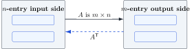

+++
order = 4
subject = "mathematics"
authoring_model = "gpt-5.6-sol"
authoring_run_id = "request-30"
authoring_provider = "openai"
authoring_reasoning_effort = "high"
curriculum_model = "gpt-5.6-sol"
curriculum_run_id = "request-25"
curriculum_provider = "openai"
curriculum_reasoning_effort = "high"
tags = ["linear-algebra", "vector-spaces", "subspaces", "rank"]
prerequisites = ["chapter:03_matrices_and_coordinate_transformations"]
provides = [
  "vector-space",
  "subspace",
  "subspace-test",
  "null-space",
  "column-space",
  "row-space",
  "left-null-space",
  "image-of-linear-transformation",
  "kernel-of-linear-transformation",
  "matrix-rank",
  "fundamental-subspaces",
]
+++

# Subspaces and fundamental spaces

<!-- card-id: d26214af-79bb-4142-bf71-287e8a526316 -->
Q: The notation \(\mathbb R^n\) means the collection of all \(n\)-entry coordinate vectors whose entries are real numbers. A **real vector space** is a collection whose objects can be added and multiplied by real scalars, with results that stay in the collection; addition is associative and commutative, has a zero and opposites; and scaling has \(1\mathbf u=\mathbf u\), distributes over vector and scalar sums, and satisfies \(c(d\mathbf u)=(cd)\mathbf u\). Why is \(\mathbb R^n\) a real vector space under the established coordinate-vector operations?
A: **Adding two \(n\)-entry vectors or scaling one produces another \(n\)-entry real vector, and the coordinate operations obey the required algebraic rules.** The zero vector and additive opposites are also in \(\mathbb R^n\).

<!-- card-id: 616bc192-7003-49c5-8ed6-35433c75709b -->
Q: Why does the collection of all real \(m\times n\) matrices form a real vector space under matrix addition and scalar–matrix multiplication?
A: **Adding two \(m\times n\) matrices or scaling one preserves the \(m\times n\) shape, and the entrywise operations obey the same algebraic rules as real numbers.** The all-zero \(m\times n\) matrix supplies the zero object.

<!-- card-id: c0c04658-f35f-4568-b52a-cd99e90a3190 -->
Q: A **subset** \(W\subseteq V\) is a collection whose members all belong to \(V\). When is \(W\) called a **subspace** of the vector space \(V\)?
A: **\(W\) is a subspace when it is itself a vector space using the same addition and scalar multiplication as \(V\).** The containing space \(V\) is the ambient vector space.

<!-- card-id: bdc6976e-47e4-4925-917c-dd1505f8f12b -->
Q: A collection is **closed** under an operation when applying that operation to allowed members gives another member. What three checks establish that a subset \(W\) of a real vector space is a subspace?
A: **Check that \(W\) contains the zero vector, is closed under vector addition, and is closed under multiplication by every real scalar.** The other vector-space rules are inherited from the ambient space.

<!-- card-id: c9fe5c20-88a6-4a18-9aa1-57591c1766bd -->
P: Let \(W\) be the collection of all vectors \(\left[\begin{array}{r}x\\y\end{array}\right]\in\mathbb R^2\) whose entries satisfy \(x+2y=0\). Determine whether \(W\) is a subspace of \(\mathbb R^2\).
S: **IDENTIFY**

This is a subspace test for a collection defined by a homogeneous coordinate equation.

**PLAN**

Check the zero vector, then use general vectors from \(W\) to check addition and scalar multiplication.

**EXECUTE**

**The collection \(W\) is a subspace of \(\mathbb R^2\).** The zero vector satisfies \(0+2(0)=0\). If \(x+2y=0\) and \(u+2v=0\), then
\[
(x+u)+2(y+v)=(x+2y)+(u+2v)=0.
\]
For any real scalar \(c\), \(cx+2(cy)=c(x+2y)=0\).

**EVALUATE**

All three subspace checks hold for arbitrary allowed vectors and scalars, not merely for a few examples.

<!-- card-id: d76c4306-4bde-4545-b5e4-8a07bf4a17b7 -->
Q: Why is the span of any collection of vectors a subspace of the coordinate-vector space containing those vectors?
A: **A sum or scalar multiple of linear combinations is another linear combination of the same vectors, and choosing all coefficients zero gives the zero vector.** Thus a span passes all three subspace checks.

<!-- card-id: a5d8d561-a281-405f-9606-1604945e5029 -->
Q: Let \(W\) contain only \(\left[\begin{array}{r}0\\0\end{array}\right]\) and \(\left[\begin{array}{r}1\\0\end{array}\right]\). Give one decisive reason that \(W\) is not a subspace of \(\mathbb R^2\).
A: **It is not closed under scalar multiplication.** The vector \(\left[\begin{array}{r}1\\0\end{array}\right]\) is in \(W\), but twice that vector, \(\left[\begin{array}{r}2\\0\end{array}\right]\), is not.

<!-- card-id: 1ee374d9-0a14-49fd-83c5-9bb5a036f488 -->
Q: Suppose \(A\mathbf x=\mathbf b\) is consistent and \(\mathbf b\ne\mathbf0\). Why is its collection of solution vectors \(\mathbf x\) not a subspace of the input space?
A: **The collection fails the zero-vector test.** Because \(A\mathbf0=\mathbf0\ne\mathbf b\), the zero input is not a solution.

<!-- card-id: eef0e657-488c-4c90-9644-51a75a9bbb52 -->
Q: For an \(m\times n\) matrix \(A\), the **null space** is written
\[
N(A)=\{\mathbf x:A\mathbf x=\mathbf0\}.
\]
Here the colon means “such that.” What vectors does this set contain, and how many entries does each have?
A: **It contains exactly the inputs that \(A\) sends to the zero vector, and each input has \(n\) entries.** Thus \(N(A)\) is a subset of \(\mathbb R^n\).

<!-- card-id: fd38ee1f-9b15-43f4-bf53-e9b700e30113 -->
Q: Why is the null space \(N(A)\) always a subspace of the input space?
A: **Matrix linearity preserves the zero output under addition and scaling.** If \(A\mathbf u=\mathbf0\) and \(A\mathbf v=\mathbf0\), then \(A(\mathbf u+\mathbf v)=\mathbf0\); also \(A(c\mathbf u)=\mathbf0\), and \(A\mathbf0=\mathbf0\).

<!-- card-id: 748327c8-db25-4c5d-abf8-38e6e1cf790e -->
P: Find the null space of
\[
A=\left[\begin{array}{rrr}1&2&-1\\0&1&1\end{array}\right]
\]
and write it as a span.
S: **IDENTIFY**

The null space is the solution set of the homogeneous system \(A\mathbf x=\mathbf0\).

**PLAN**

Solve for the pivot variables in terms of a free variable, then factor the parameter from the solution vector.

**EXECUTE**

**The null space is \(N(A)=\operatorname{span}\left\{\left[\begin{array}{r}3\\-1\\1\end{array}\right]\right\}\).** Let \(x_3=t\). The second equation gives \(x_2=-t\), and the first then gives \(x_1=3t\), so
\[
\mathbf x=t\left[\begin{array}{r}3\\-1\\1\end{array}\right].
\]

**EVALUATE**

Multiplication gives \(A\left[\begin{array}{r}3\\-1\\1\end{array}\right]=\left[\begin{array}{r}0\\0\end{array}\right]\), so every displayed scalar multiple is in the null space.

<!-- card-id: 21d8cc66-6095-4db2-845c-5352286765f1 -->
Q: The **kernel** of a linear transformation \(T\) is the collection of inputs sent to the zero output. If \(T(\mathbf x)=A\mathbf x\), how are \(\ker(T)\) and \(N(A)\) related?
A: **They are the same set: \(\ker(T)=N(A)\).** Both consist exactly of the inputs satisfying \(A\mathbf x=\mathbf0\).

<!-- card-id: 2a9f4a5f-c3d5-4992-9667-02f49230c4b8 -->
Q: For an \(m\times n\) matrix \(A\), the **column space** \(\operatorname{Col}(A)\) is the span of the columns of \(A\). What kind of vectors does it contain, and how many entries does each have?
A: **It contains all linear combinations of the columns, and each vector has \(m\) entries.** Thus \(\operatorname{Col}(A)\) is a subset of the output space \(\mathbb R^m\).

<!-- card-id: fbba2858-d2fa-467f-acc4-1c9c000b64e6 -->
Q: The **image** of a transformation is the collection of all outputs it can produce. If \(T(\mathbf x)=A\mathbf x\), why is \(\operatorname{im}(T)=\operatorname{Col}(A)\)?
A: **Every output \(A\mathbf x\) is a linear combination of the columns of \(A\), and every such column combination is produced by using its coefficients as the entries of \(\mathbf x\).** The two collections are therefore equal.

<!-- card-id: 237fbfa4-8a5d-4326-8336-3c1604a45be1 -->
Q: What column-space condition is equivalent to consistency of the matrix equation \(A\mathbf x=\mathbf b\)?
A: **The equation is consistent exactly when \(\mathbf b\in\operatorname{Col}(A)\).** A solution \(\mathbf x\) supplies the coefficients that express \(\mathbf b\) as a linear combination of the columns.

<!-- card-id: ae540adf-683d-4a03-b8fd-01e677a57a0e -->
P: Let
\[
A=\left[\begin{array}{rr}1&2\\2&4\\0&1\end{array}\right],
\qquad
\mathbf b=\left[\begin{array}{r}3\\6\\1\end{array}\right].
\]
Determine whether \(\mathbf b\) belongs to \(\operatorname{Col}(A)\).
S: **IDENTIFY**

This is a column-space membership question, equivalent to testing consistency of \(A\mathbf x=\mathbf b\).

**PLAN**

Use unknown column weights \(c_1,c_2\) and solve the resulting coordinate equations.

**EXECUTE**

**Yes, \(\mathbf b\in\operatorname{Col}(A)\), because \(\mathbf b\) is the sum of the two columns of \(A\).** The third coordinate gives \(c_2=1\), and the first gives \(c_1+2=3\), so \(c_1=1\). The second coordinate then gives \(2(1)+4(1)=6\).

**EVALUATE**

Directly adding the columns gives \(\left[\begin{array}{r}1\\2\\0\end{array}\right]+\left[\begin{array}{r}2\\4\\1\end{array}\right]=\mathbf b\), which certifies membership.

<!-- card-id: f7bc2802-2c72-44b6-8885-69b4e9439367 -->
Q: Why is \(\operatorname{Col}(A)\) always a subspace of the output space?
A: **The column space is a span, and every span contains zero and is closed under addition and scalar multiplication.** Therefore it passes the subspace test.

<!-- card-id: c286ac05-2be6-4fba-9bd6-6e9492625e11 -->
Q: The **row space** \(\operatorname{Row}(A)\) is the span of the rows of \(A\), with each row treated as a column vector. If \(A\) is \(m\times n\), why is \(\operatorname{Row}(A)=\operatorname{Col}(A^{\mathsf T})\), and where does this space live?
A: **Transposing \(A\) turns its rows into the columns of \(A^{\mathsf T}\), so the two spans are equal; their vectors have \(n\) entries and lie in \(\mathbb R^n\).**

<!-- card-id: 557cbf6a-43d1-47e0-bec5-5566096d4ff5 -->
P: A matrix and its reduced row echelon form are
\[
A=\left[\begin{array}{rrr}1&2&3\\2&4&6\end{array}\right],
\qquad
R=\left[\begin{array}{rrr}1&2&3\\0&0&0\end{array}\right].
\]
Reversible row operations replace rows by row combinations and can be undone,
so they preserve the row space. Find a spanning description of
\(\operatorname{Row}(A)\).
S: **IDENTIFY**

This is a row-space calculation from a row-reduction record.

**PLAN**

Reversible row operations replace rows by row combinations without changing the span of the rows. Use the nonzero rows of \(R\).

**EXECUTE**

**The row space is \(\operatorname{Row}(A)=\operatorname{span}\left\{\left[\begin{array}{r}1\\2\\3\end{array}\right]\right\}\).** The only nonzero row of \(R\) supplies the displayed generator.

**EVALUATE**

The second original row is twice the first, so both original rows belong to the displayed span; the reversible reduction guarantees the reverse containment as well.

<!-- card-id: 7dfedc32-5c99-4877-8bb7-912fad921262 -->
Q: The **left null space** of an \(m\times n\) matrix \(A\) is \(N(A^{\mathsf T})\). What equation defines its vectors, and how many entries does each vector have?
A: **Its vectors satisfy \(A^{\mathsf T}\mathbf y=\mathbf0\), and each \(\mathbf y\) has \(m\) entries.** The transpose has \(m\) columns, so its inputs lie in \(\mathbb R^m\).

<!-- card-id: b1d130a2-642f-4ac9-a172-d8da0ac25d4c -->
P: Find the left null space of
\[
A=\left[\begin{array}{rrr}1&2&3\\2&4&6\end{array}\right].
\]
S: **IDENTIFY**

The left null space is the null space of \(A^{\mathsf T}\), so its vectors solve \(A^{\mathsf T}\mathbf y=\mathbf0\).

**PLAN**

Write \(\mathbf y=\left[\begin{array}{r}y_1\\y_2\end{array}\right]\), solve the homogeneous equations, and express the result as a span.

**EXECUTE**

**The left null space is \(N(A^{\mathsf T})=\operatorname{span}\left\{\left[\begin{array}{r}-2\\1\end{array}\right]\right\}\).** Each equation reduces to \(y_1+2y_2=0\). Setting \(y_2=t\) gives \(\mathbf y=t\left[\begin{array}{r}-2\\1\end{array}\right]\).

**EVALUATE**

Substitution gives \(A^{\mathsf T}\left[\begin{array}{r}-2\\1\end{array}\right]=\left[\begin{array}{r}0\\0\\0\end{array}\right]\), confirming the spanning vector.

<!-- card-id: e523b540-b8cd-4446-a2d0-312aea8f88e9 -->
Q: For an \(m\times n\) matrix \(A\), the diagram separates the \(n\)-entry input side from the \(m\)-entry output side; the blank slots stand for matrix-related spaces. Which two established spaces belong on the \(n\)-entry side?

A: **The null space \(N(A)\) and the row space \(\operatorname{Row}(A)=\operatorname{Col}(A^{\mathsf T})\) belong on the \(n\)-entry side.** Both are subspaces of the input coordinate space \(\mathbb R^n\).

<!-- card-id: 6f1e05d6-b4ac-4d02-96f2-a4d15f80d0ec -->
Q: For an \(m\times n\) matrix \(A\), the diagram separates the \(n\)-entry input side from the \(m\)-entry output side; the blank slots stand for matrix-related spaces. Which two established spaces belong on the \(m\)-entry side?

A: **The column space \(\operatorname{Col}(A)\) and the left null space \(N(A^{\mathsf T})\) belong on the \(m\)-entry side.** Both are subspaces of the output coordinate space \(\mathbb R^m\).

<!-- card-id: ae4de958-99e3-4aa6-9036-00095ed9d9d9 -->
Q: The **rank** of a matrix is defined from any echelon form obtained by valid row operations. What does the rank count?
A: **The rank counts the pivot positions, equivalently the nonzero rows in echelon form.** Valid row operations do not change this count.

<!-- card-id: ab7852fa-93f5-47a9-9d43-e13f036a9fee -->
Q: What is the rank of the echelon matrix
\[
\left[\begin{array}{rrrr}1&2&0&5\\0&0&1&-1\\0&0&0&0\end{array}\right]?
\]
Give the decisive count.
A: **The rank is \(2\).** There are two pivot positions and two nonzero rows.

<!-- card-id: 8cf924b9-7e5e-4e85-8ca5-5090e169b6df -->
Q: Suppose the pivot columns of the RREF of \(A\) are columns 1 and 3. Reversible row operations preserve which coefficient choices make a column combination zero, but they change the actual column vectors. To obtain vectors that span \(\operatorname{Col}(A)\), should you take columns 1 and 3 from \(A\) or from its RREF? Why?
A: **Take columns 1 and 3 from the original matrix \(A\).** Row operations preserve the coefficient relations that identify pivot positions, but they generally change the actual column space.

<!-- card-id: fd864615-6c1d-483e-bffe-ce02f11b8bad -->
Q: If a matrix has rank \(r\), which \(r\) columns and which \(r\) rows give useful spanning descriptions of its column and row spaces?
A: **Use the \(r\) original columns whose positions become pivot columns, and use the \(r\) nonzero rows of an RREF.** The two selections come from different matrices because row reduction preserves row space but generally changes column space.

<!-- card-id: 36048395-3336-46a4-a0d6-778ddc249d5a -->
P: A matrix and its RREF are
\[
A=\left[\begin{array}{rrr}1&2&3\\2&4&7\end{array}\right],
\qquad
R=\left[\begin{array}{rrr}1&2&0\\0&0&1\end{array}\right].
\]
Use this record to give spanning descriptions of \(\operatorname{Col}(A)\) and \(\operatorname{Row}(A)\).
S: **IDENTIFY**

This is a mixed pivot-column and nonzero-row selection problem.

**PLAN**

Locate the pivot positions in \(R\). Take matching columns from the original \(A\) for column space, and take nonzero rows from \(R\) for row space.

**EXECUTE**

**The spaces are \(\operatorname{Col}(A)=\operatorname{span}\left\{\left[\begin{array}{r}1\\2\end{array}\right],\left[\begin{array}{r}3\\7\end{array}\right]\right\}\) and \(\operatorname{Row}(A)=\operatorname{span}\left\{\left[\begin{array}{r}1\\2\\0\end{array}\right],\left[\begin{array}{r}0\\0\\1\end{array}\right]\right\}\).** The pivots of \(R\) are in columns 1 and 3.

**EVALUATE**

The omitted second column of \(A\) is twice its first. Also the original rows satisfy \(\left[\begin{array}{rrr}1&2&3\end{array}\right]=\left[\begin{array}{rrr}1&2&0\end{array}\right]+3\left[\begin{array}{rrr}0&0&1\end{array}\right]\) and \(\left[\begin{array}{rrr}2&4&7\end{array}\right]=2\left[\begin{array}{rrr}1&2&0\end{array}\right]+7\left[\begin{array}{rrr}0&0&1\end{array}\right]\).

<!-- card-id: a1668050-7b62-45ec-a0c8-4e049775e987 -->
Q: The null space, column space, row space, and left null space of a matrix are collectively called what?
A: **They are the matrix's four fundamental spaces.** In symbols they are \(N(A)\), \(\operatorname{Col}(A)\), \(\operatorname{Row}(A)=\operatorname{Col}(A^{\mathsf T})\), and \(N(A^{\mathsf T})\).

<!-- card-id: 336ba51b-af9d-48dd-ab5f-2fa5d53e0f80 -->
Q: A learner uses column-space membership to answer both “Which inputs are sent to zero?” and “Which outputs can the matrix produce?” What distinction should replace this single test?
A: **Use the kernel or null space for inputs sent to zero, and use the image or column space for attainable outputs.** The first solves \(A\mathbf x=\mathbf0\); the second asks whether an output equals \(A\mathbf x\) for some input.
